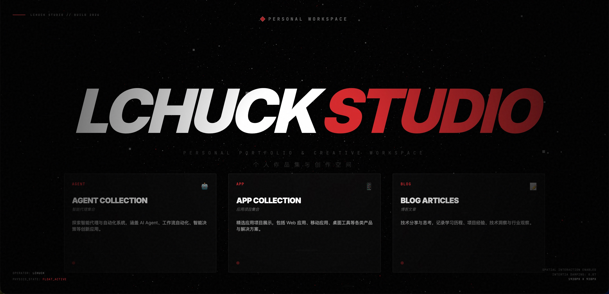

# LChuck Studio



个人作品集与创作空间，融合物理引擎交互、3D 视觉与 AI 客服浮窗的现代化个人网站。

**Slogan:** 数据架构 · 自动化 · 超级个体 | 拒绝低效内卷，用架构思维和代码，构建你的自动化资产。

---

## ✨ 特性

- **物理引擎交互** - 基于 Matter.js，卡片随鼠标产生排斥效果，支持拖拽（桌面端）
- **3D 粒子背景** - Three.js 动态粒子系统，营造沉浸式视觉
- **AI 客服浮窗** - Intercom 风格浮窗，支持多角色切换（留学咨询 / 数据架构 / 副业搞钱）
- **响应式设计** - 移动端垂直堆叠、桌面端横向布局，支持触摸滚动
- **打字机动画** - 副标题与 Slogan 逐字显示
- **博客系统** - Markdown 文章，支持 `src/posts/` 源文件与 `public/posts/` 图片

---

## 🎯 主要内容

| 模块 | 说明 |
|------|------|
| **Digital Workforce** | 数字员工 / 智能代理：欧洲选课助手、RAG 知识库清洗专家 |
| **Product Toolkit** | 产品与工具箱：Excel/PDF 自动化、数据清洗 SaaS |
| **Engineering Log** | 工程日志：技术、增长与一人公司构建实录 |

---

## 🛠️ 技术栈

| 类别 | 技术 |
|------|------|
| 前端框架 | React 19 + TypeScript 5.8 |
| 构建工具 | Vite 6 |
| 物理引擎 | Matter.js |
| 3D 图形 | Three.js |
| 动画 | Framer Motion |
| 样式 | Tailwind CSS (CDN) |
| AI 服务 | DeepSeek API (OpenAI 兼容) |

---

## 📁 项目结构

```
lchuck-studio/
├── components/
│   ├── ChatbotWidget.tsx    # AI 客服浮窗（Intercom 风格）
│   ├── Logo.tsx             # 品牌 Logo 与 System Online 状态
│   ├── NavigationTabs.tsx   # 顶部导航
│   ├── PhysicsSystem.tsx    # 物理引擎核心
│   ├── ThreeBackground.tsx  # 3D 粒子背景
│   └── ...
├── config/
│   └── chatbot.ts           # AI 预设角色、默认配置
├── pages/
│   ├── Home.tsx             # 首页（物理卡片 + 副标题）
│   ├── Agents.tsx           # Digital Workforce
│   ├── Apps.tsx             # Product Toolkit
│   ├── Blog.tsx             # Engineering Log 列表
│   └── BlogPost.tsx         # Markdown 文章详情
├── services/
│   └── aiService.ts         # DeepSeek 流式调用
├── src/posts/               # Markdown 文章源文件
├── public/posts/            # 文章配图
├── constants.ts             # SECTIONS、PHYSICS_CONFIG
├── App.tsx
└── index.html
```

---

## 🚀 快速开始

### 前置要求

- Node.js 18+
- npm 或 yarn

### 安装与运行

```bash
npm install
npm run dev
```

开发服务器默认在 `http://127.0.0.1:5173` 启动（`--host 127.0.0.1` 避免网络错误）。

### AI 客服配置

大模型 API Key 通过 `VITE_DEEPSEEK_API_KEY` 注入：

| 环境 | 配置方式 |
|------|----------|
| **本地开发** | 在项目根目录创建 `.env` 文件，添加 `VITE_DEEPSEEK_API_KEY=sk-xxx` |
| **EdgeOne 部署** | 在 EdgeOne 控制台配置环境变量 `VITE_DEEPSEEK_API_KEY` |

未配置时，浮窗会提示「服务暂不可用」。

### 构建与预览

```bash
npm run build
npm run preview
```

---

## 🎨 核心功能

### 物理引擎

- 卡片初始悬浮，2.5 秒后受重力影响
- 桌面端：鼠标靠近产生排斥力，支持拖拽
- 移动端：禁用 Mouse 监听，保证滚动与点击

### AI 客服浮窗

- **默认角色**：🇪🇺 欧洲留学咨询
- **可切换**：🐍 数据架构/Python 专家、💼 一人公司/副业搞钱
- 点击右下角 FAB 打开/关闭浮窗
- 角色切换时自动更新 System Prompt 并重置对话

### 博客

- 文章存放在 `src/posts/*.md`
- 图片存放在 `public/posts/`，Markdown 中引用 `/posts/xxx.png`
- 路由：`/blog` 列表，`/blog/:slug` 详情

---

## 📝 配置说明

### 修改首页卡片

编辑 `constants.ts` 中的 `SECTIONS`：

```typescript
export const SECTIONS: Section[] = [
  { id: 'agents', title: 'DIGITAL WORKFORCE', titleCn: '...', type: 'AGENT', ... },
  // ...
];
```

### 修改物理参数

在 `constants.ts` 中调整 `PHYSICS_CONFIG`：

```typescript
export const PHYSICS_CONFIG = {
  GRAVITY: 0.08,
  AIR_FRICTION: 0.07,
  REPELL_STRENGTH: 0.006,
  REPELL_RADIUS: 300,
  COLLAPSE_DELAY: 2500,
};
```

### 修改 AI 预设角色

编辑 `config/chatbot.ts` 中的 `PRESET_ROLES` 和 `DEFAULT_AI_CONFIG`。

---

## 🌐 浏览器支持

- Chrome（推荐）
- Firefox
- Safari（含 iOS）
- Edge

---

## 📄 许可证

个人作品集项目。

---

**LChuck Studio** | 数据架构 · 自动化 · 超级个体 | Build 2026
